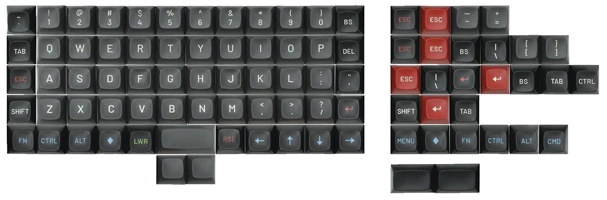
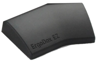
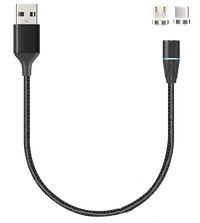

# Keebio Iris

## Background

The [Keebio Iris](https://keeb.io/collections/iris-split-ergonomic-keyboard) is a split columnar keyboard with an onboard ATmega32u4 controller.  It's my fourth split columnar and I like it the best so far (using it right now).

The Iris runs QMK and is VIA compatible with a few tweaks.
Revision 6 has full per-key RGB and USB-C connectors.

It's similar in layout to the [Sofle and Lily58](https://compare.splitkb.com/), but with a different arrangement of thumb keys and it's not an open source hardware design.

You can buy Iris kits or [pre-built](https://keeb.io/collections/iris-split-ergonomic-keyboard/products/iris-keyboard-pre-built) with lots of options to choose from directly from Keebio which is US based and has a quick turn around with in stock items.

## My Setup

I went without the optional rotary encoders. I don't use them very much and there are not as many thumb keys on Iris, so I didn't want to give any up.

####Switches:
I went with Keebio's in stock [Durock Shrimp](https://divinikey.com/products/durock-shrimp-silent-tactile-switches) tactile option.  I am also a fan of [Zeal Zilents 67g](https://zealpc.net/products/zilent), and the Shrimps are very similar, but less expensive.

#### Key Caps:
I used [Drop MATT3O MT3 SUSUWATARI](https://drop.com/buy/drop-matt3o-mt3-susuwatari-custom-keycap-set?defaultSelectionIds=952687) caps. The [Ortho kit](https://drop.com/buy/drop-matt3o-mt3-susuwatari-custom-keycap-set?defaultSelectionIds=952687) gives you all the 1U caps you need and some flexibiliy in placement. As of July 2022, Matt3o and Drop aren't working together anymore so these may become hard to find.

MT3 is a really [high profile](https://www.keycaps.info/) that's a lot like SA. I ended up liking the feel a lot.  These are ABS. Drop and Matt3o have the /dev/tty kit that is PBT, but that's harder to find.

A downside of the MT3 profile is that I haven't found any shine through (RGB lit lettering) options. Matt3o on his Discord said that was unlikely to be an option in his future caps.  I like having per-key RGB to highlight things like WASM and other media controls on layers, but it's a lot less visible with tall and opaque key caps.  I'm hoping to find some tall profile key caps that support shine through in the future.

 #### Tenting:
 In the past, I've used ergodox style legs and always found them wobbly.  Instead of using the bolts kits or leg ktis, I am using a [really solid tenting kit](https://dygma.com/products/tenting-kit) from a split staggered keyboard, the [Dygma Raise](https://dygma.com/products/dygma-raise).  The mount holes don't line up, but you and get the keyboard to adhere using [Sewell AirStick Tape](https://www.amazon.com/dp/B00M7FC1K8) which is removable and doesn't leave a mess. I might end up drilling some holes to make it more permanent.

 This does mean it's not as easy to get to the manual reset switches on the bottom of the Iris, but I've been able to use the SW reset when needed.

 The tenting kit give a variety of angles (10,20,30,40). I find 20 works well for me.

#### Wrist Rest:
I am using an [ErgoDox EZ Wing](https://ergodox-ez.com/products/wing) wrist rests which are also mounted to the tent kit using AirStick.  They collect lint, but really support my wrists well and work well with the tall MT3 caps.

#### Cabling:
I need to move desks and the USB-C connectors are pretty recessed so I got a few of these [magnetic USB cables](https://www.amazon.com/gp/product/B07QKFR9VK/) to easily connect and disconnect my keyboard.  The cable supports firmware updates and has worked well for easy "reboots" when needed too.  I'd really like to find something similar for the split cable too, but I haven't seen any usb-c to usb-c with magnetic ends.

#### Layout:
For QMK, I'm using QK_GRAVE_ESCAPE in the upper left corner with KC_GRAVE the the LOWER layer for TAB.

Left side edge: ESC, TAB, CTRL, Shift
Left thumbs CMD, Lower, Return, left bracket.
Right side edge: Backspace, Backslash, quote, shift
Right thumbs: right bracket, space, Raise, ALT(option)

I flipped the bracket keys upside down and place them above Return and Space for thumbs.

### Final Thoughts:
This is the columnar keyboard that finally got my WPM back to where I was at on staggered boards.   I had tried Ergodox EZ, Moonlander and recently a Sofle, but the Iris stuck.

I've been very happy with the quality and support from Keebio.

I really thought I'd want more thumb options, but so far I've been able to make it work without. I'm hoping to enable Home Row Mods in the coming weeks and try adjusting to those.